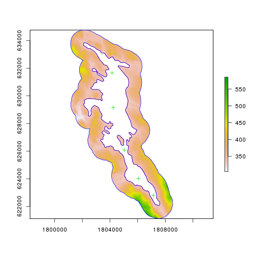

## Introduction

Spatial data analysis capabilities in R have been steadily growing over the last several years.  We are now to the point where nearly all Geographic Information Systems (GIS) functionality can be accomplished without leaving R.  The one area that had lagged behind was spatial data visualization and interactivity.  This too is changing rapidly.  Initially, spatial data visualization had been handled via base plotting methods (e.g from \CRANpkg{sp} or \CRANpkg{raster}) or via additional plotting packages such as \CRANpkg{ggplot2}\citep{pebesma2005classes, bivand2013asdar, raster, ggplot2}.  While these methods provide the ability to make high quality maps, they do not provide interactivity, a hallmark of GIS.

To address this, most solutions (e.g. \CRANpkg{ggmap}, \CRANpkg{leaflet}, \CRANpkg{mapview} etc.) have relied on javascript libraries or other web APIs \citep{ggmap, leaflet, mapview}.  These provide a modern interface, with a rich set of basemaps, but all assume a geographic coordinate system or Web Mercator coordinate reference system.  In the case of typical spatial data analysis workflow it is often desirable to quickly map the resultant spatial datasets in the projection chosen for the analysis.  Currently, this is not possible with the most used javascript libraries.  

I developed \CRANpkg{quickmapr} to fill this gap and provide spatial data analysts with a tool to quickly map multiple layers and interact with the resultant map without having to utilize various APIs or external libraries and without having to re-project data. The goals of this paper are to describe the basic usage of \pkg{quickmapr}, show several examples of its use, and outline changes expected in future versions. We also briefly discuss the contribtuion that \pkg{quickmapr} makes to the existing suite of spatial data visualization tools in R. 

## Basic usage

The basic workflow for using \pkg{quickmapr} is as follows:

1. Use the \code{qmap()} function to create a \code{qmap} object.  This object holds the data  and pertinent information about the current visualization environment (e.g. symbology, zoom/pan extent, etc.).  This first step is acheived with:


```r
library(quickmapr)
data(lake)

qm <- qmap(elev,lake,samples,buffer)
```



2. With a \code{qmap} object created you may interact with the map using the various \pkg{quickmapr} functions. 

## The \code{qmap} function and object

The \code{qmap} object is an S3 object, with a class of "qmap" and contains a list with 11 items.  These items are:

- map_data: a list of all data used to create the map.
- map_extent: the current map extent.  Initially it is the maximum extent that encompasses all of `map_data`, but changes to reflect the currently selected zoom extent.
- orig_extent: original extent of the map.  Does not change and is used to reset map.
- draw_order: controls draw order of `map_data`.  Defaults to order of `map_data`
- colors: outline, line, or point colors for vector datasets in `map_data`
- fill: fill colors for polygons
- map: 
- basemap: A character string indicating which type of basemap to fetch from the [USGS National Map]()
- col_tbl:
- values:
- resolution: Resolution of `basemap`.  Controls quality of image with smaller resolution resulting in higher quality image, but slower drawing.

Currently, the only implemented default method is for plotting which may be accessed either through `qm`, `plot(qm)` or `print(qm)`.    

## Zooming and panning

## Identification and selection

## Basemaps from the USGS National Map

## Summary

This file is only a basic article template. For full details of _The R Journal_ style and information on how to prepare your article for submission, see the [Instructions for Authors](https://journal.r-project.org/share/author-guide.pdf).


\bibliography{hollister}
